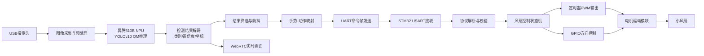
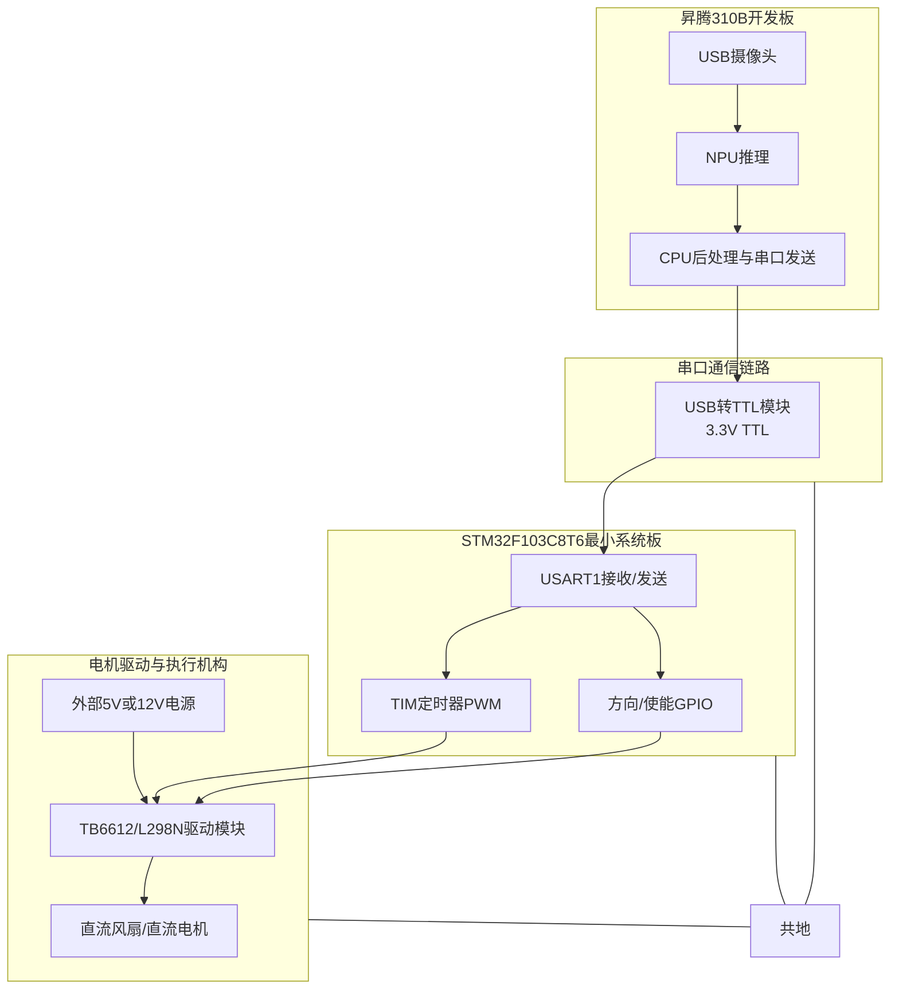
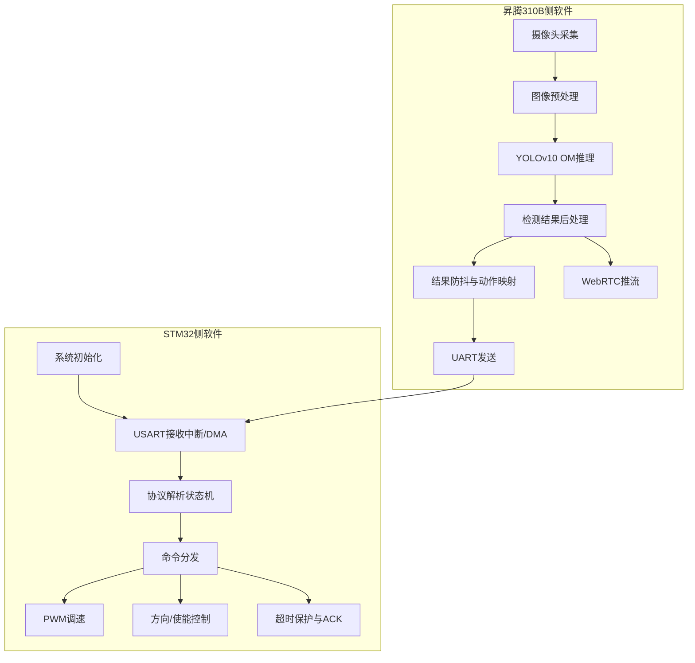
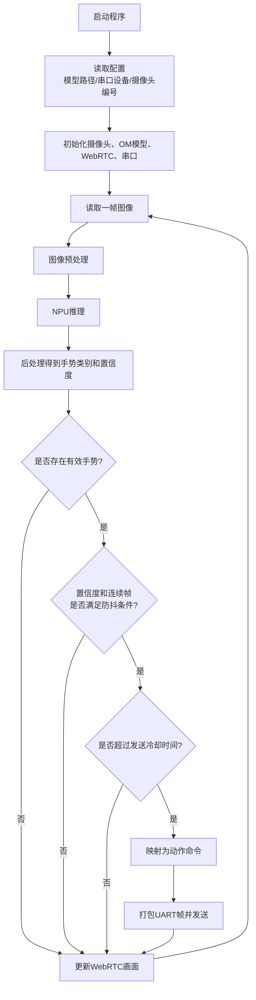
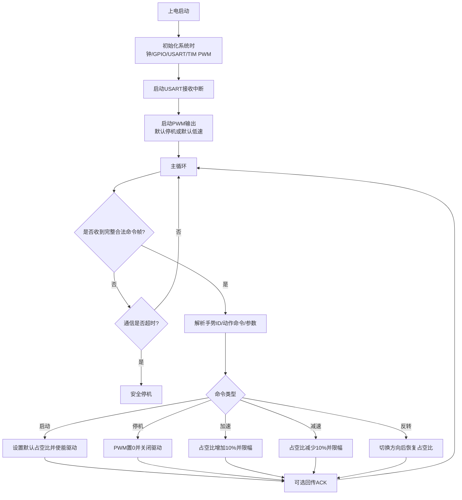

# 昇腾310B手势识别控制风扇系统设计文档

## 一、项目基本信息

| 项目 | 内容 |
| ---- | ---- |
| 项目名称 | 基于昇腾310B的实时手势识别与STM32风扇控制系统 |
| 选题方向 | 题目6：昇腾310B手势识别 |
| 小组成员 | 黄家耀、欧恩沛 |
| 设计文档提交时间 | 2026-07-02 9:00前 |
| 系统目标 | 基于昇腾310B完成实时手势识别与WebRTC显示，并将识别结果通过串口发送至STM32，由STM32驱动小风扇实现加速、减速、停机、启动、反转等动作 |

本项目采用“AI视觉识别 + 串口通信 + 嵌入式执行控制”的分层设计。昇腾310B侧负责USB摄像头图像采集、YOLOv10手势识别、识别结果筛选与串口下发；STM32F103C8T6侧负责命令接收、协议解析、PWM调速、方向控制与安全保护；风扇作为执行机构展示无接触手势控制效果。

## 二、设计依据与需求分析

### 2.1 课程题目要求

根据课程设计题目“昇腾310B手势识别”的要求，系统需要完成以下功能：

| 类型 | 要求 | 本组方案 |
| ---- | ---- | ---- |
| 基本要求1 | 完成昇腾310B环境搭建，成功运行OM推理 | 复用老师提供的基础代码，确认摄像头采集、OM推理和识别结果输出链路 |
| 基本要求2 | 实现至少18种手势检测功能 | 使用YOLOv10n_gestures模型进行实时手势检测，控制动作优先选取识别稳定的4-6类手势 |
| 基本要求3 | 实现WebRTC远程推流，在浏览器查看实时检测画面 | 保留基础代码中的WebRTC显示链路，用于现场展示检测框、类别和置信度 |
| 扩展要求 | STM32接收手势识别结果，驱动小风扇实现加速、减速、停机、反转等功能 | 昇腾310B通过UART发送命令帧，STM32解析后输出PWM和方向控制信号 |

### 2.2 本组任务边界

老师提供的基础代码已经具备摄像头采集、手势识别推理和识别结果写入能力。本组不从零训练模型，也不将主要工作放在模型转换和推理框架改造上，而是围绕扩展要求完成端到端控制闭环：

1. 在昇腾310B CPU侧读取最新手势类别、置信度和时间戳。
2. 对识别结果进行置信度阈值、连续帧一致性和发送冷却时间过滤。
3. 按固定串口协议向STM32发送控制命令。
4. STM32解析串口命令，控制电机驱动模块输出风扇PWM和方向信号。
5. 联调WebRTC画面、串口日志和风扇动作，完成现场演示。

## 三、物料到位情况

用户已确认本项目所需物料已经全部到达。本阶段重点从“采购计划”转入“实物核对、接线验证与单模块调试”。

### 3.1 已到货物料清单

| 序号 | 物料 | 型号/规格 | 数量 | 到位状态 | 核对与用途 |
| ---- | ---- | ---- | ---- | ---- | ---- |
| 1 | 昇腾310B开发板 | OrangePi AIpro或课程提供板卡 | 1 | 已到位 | 运行YOLOv10手势识别、WebRTC推流和串口发送程序 |
| 2 | STM32最小系统板 | STM32F103C8T6 | 1 | 已到位 | 接收串口命令，输出PWM和方向控制信号 |
| 3 | USB摄像头 | 支持MJPG，推荐720p/30fps | 1 | 已到位 | 采集手势图像输入昇腾310B |
| 4 | USB转TTL模块 | CH340/CP2102，3.3V TTL | 1 | 已到位 | 连接昇腾310B与STM32 USART |
| 5 | 小风扇/直流电机 | 5V或12V直流风扇 | 1 | 已到位 | 执行手势控制动作 |
| 6 | 电机驱动模块 | TB6612或L298N | 1 | 已到位 | 隔离STM32与风扇负载，实现调速与方向控制 |
| 7 | 杜邦线 | 公对母/母对母若干 | 若干 | 已到位 | 模块间临时连接 |
| 8 | 外部电源 | 5V/12V适配器或电池 | 1 | 已到位 | 为风扇和电机驱动模块供电 |
| 9 | 面包板 | 小型面包板 | 1 | 已到位 | 临时搭建和测试电路 |

### 3.2 实物核对计划

| 核对项 | 方法 | 通过标准 |
| ---- | ---- | ---- |
| 昇腾310B开发板 | 上电启动，查看系统和NPU环境 | 能进入系统并运行基础识别程序 |
| 摄像头 | `v4l2-ctl`或OpenCV打开设备 | 能稳定输出视频帧 |
| USB转TTL | 连接PC串口助手或STM32回环测试 | 收发数据正常，电平为3.3V TTL |
| STM32最小系统板 | 下载串口测试程序或LED测试程序 | 可正常烧录、运行和串口打印 |
| 电机驱动与风扇 | 外部电源供电，手动给定PWM/方向信号 | 风扇能启动、停止、调速；如电机支持双向则可反转 |

## 四、系统总体方案设计

### 4.1 总体架构

系统划分为视觉识别层、通信协议层和执行控制层。昇腾310B完成AI推理和人机可视化，STM32完成实时控制，二者通过串口解耦。



### 4.2 数据流说明

| 阶段 | 数据内容 | 处理模块 |
| ---- | ---- | ---- |
| 图像输入 | 摄像头原始帧，推荐640x480或1280x720 | OpenCV/摄像头采集模块 |
| 预处理 | letterbox缩放至640x640、归一化、通道转换 | 昇腾310B CPU侧预处理 |
| NPU推理 | YOLOv10输出检测框、类别、置信度 | 昇腾310B NPU |
| 后处理 | 坐标映射、类别筛选、置信度判断 | 检测结果解码模块 |
| 防抖 | 连续帧一致性、发送间隔、状态记忆 | 结果筛选模块 |
| 命令下发 | 固定长度UART二进制帧 | 串口发送模块 |
| 动作执行 | PWM占空比、方向IO、启动/停止状态 | STM32风扇控制模块 |

### 4.3 控制策略

控制系统采用离散命令控制，而不是连续跟踪控制。手势被识别后转换为有限个动作命令：

1. 启动：恢复默认速度。
2. 停机：PWM占空比置0。
3. 加速：当前占空比增加一个步进值。
4. 减速：当前占空比减少一个步进值。
5. 反转：切换驱动方向，普通二线风扇不支持反转时使用双向直流电机或指示灯替代演示。

为避免单帧误识别造成风扇误动作，昇腾310B侧设置防抖条件：同一手势连续出现至少3帧、置信度大于0.60，且距离上一次发送命令超过300 ms时才下发命令。

## 五、硬件部分详细设计

### 5.1 硬件框图



### 5.2 模块连接规划

#### 5.2.1 昇腾310B与STM32串口连接

| 昇腾310B/USB转TTL端 | STM32F103C8T6端 | 说明 |
| ---- | ---- | ---- |
| USB接口 | 昇腾310B USB口 | USB转TTL模块插入昇腾310B，系统识别为`/dev/ttyUSB0`或类似设备 |
| TTL_TXD | PA10 / USART1_RX | 昇腾310B发送命令，STM32接收 |
| TTL_RXD | PA9 / USART1_TX | 可选，用于STM32回传ACK或调试信息 |
| GND | GND | 必须共地 |
| VCC | 不直接给STM32供电或按模块说明连接 | 避免电源冲突，优先让STM32使用独立稳定供电 |

串口参数：

| 参数 | 取值 |
| ---- | ---- |
| 波特率 | 115200 bps |
| 数据位 | 8 |
| 停止位 | 1 |
| 校验位 | None |
| 流控 | None |
| 电平 | 3.3V TTL |

#### 5.2.2 STM32与电机驱动模块连接

若使用TB6612，建议连接如下：

| TB6612引脚 | STM32引脚建议 | 作用 |
| ---- | ---- | ---- |
| PWMA | PA8 / TIM1_CH1 | PWM调速 |
| AIN1 | PB0 | 方向控制1 |
| AIN2 | PB1 | 方向控制2 |
| STBY | PB10 | 驱动使能，高电平有效 |
| VCC | 3.3V或5V逻辑电源 | 按模块说明选择 |
| VM | 5V或12V外部电源 | 风扇/电机供电 |
| GND | GND | 与STM32、外部电源共地 |
| AO1/AO2 | 风扇或直流电机两端 | 驱动输出 |

若使用L298N，建议连接如下：

| L298N引脚 | STM32引脚建议 | 作用 |
| ---- | ---- | ---- |
| ENA | PA8 / TIM1_CH1 | PWM调速 |
| IN1 | PB0 | 方向控制1 |
| IN2 | PB1 | 方向控制2 |
| +12V/VM | 5V或12V外部电源 | 风扇/电机供电 |
| 5V逻辑端 | 按模块跳帽和说明连接 | 逻辑供电 |
| GND | GND | 与STM32、外部电源共地 |
| OUT1/OUT2 | 风扇或直流电机两端 | 驱动输出 |

### 5.3 关键元件参数与计算

#### 5.3.1 电机驱动电流裕量

风扇不能由STM32 IO口直接驱动。STM32单个GPIO推荐只输出逻辑控制信号，负载电流应由电机驱动模块和外部电源承担。

| 项目 | 设计取值 |
| ---- | ---- |
| 风扇额定电压 | 根据实物选择5V或12V |
| 风扇运行电流 | 以实物标称为准，按0.2A-0.5A预估 |
| 启动瞬时电流 | 可能为额定电流的2倍左右 |
| 驱动模块电流能力 | 需大于风扇启动电流，优先选择单通道1A以上余量 |
| 供电策略 | 风扇单独供电，STM32只提供PWM/方向控制，共地连接 |

#### 5.3.2 PWM频率与占空比

STM32F103C8T6使用定时器输出PWM控制风扇速度。为降低可闻噪声并保持控制稳定，PWM频率计划设置在10 kHz-20 kHz范围内。

示例设计：若定时器时钟为72 MHz，设置预分频PSC=71，则计数频率为1 MHz；设置ARR=99时，PWM频率为10 kHz，占空比分辨率为1%。

| 参数 | 示例值 | 说明 |
| ---- | ---- | ---- |
| 定时器时钟 | 72 MHz | STM32F103常见系统时钟 |
| PSC | 71 | 72 MHz / (71+1) = 1 MHz |
| ARR | 99 | 1 MHz / (99+1) = 10 kHz |
| CCR | 0-100 | 对应0%-100%占空比 |
| 默认占空比 | 50% | 启动后默认中速 |
| 步进 | 10% | 加速/减速每次变化10% |

#### 5.3.3 串口带宽估算

命令帧长度为6字节，波特率为115200 bps。按1个起始位、8个数据位、1个停止位估算，每字节约10 bit。

单帧传输量约为60 bit，理论传输时间约为：

```text
60 bit / 115200 bps = 0.52 ms
```

串口传输时间远小于摄像头推理和防抖时间，对端到端控制延迟影响很小。

### 5.4 PCB布局规划

本阶段采用最小系统板、驱动模块、面包板和杜邦线完成课程设计演示，暂不强制制作PCB。若后续扩展为PCB，布局原则如下：

| 区域 | 布局要求 |
| ---- | ---- |
| MCU区域 | STM32最小系统、下载接口、串口接口靠近板边，便于调试 |
| 电机驱动区域 | 驱动芯片靠近风扇接口，电源线和电机线走线加宽 |
| 电源区域 | 风扇电源与逻辑电源分区，公共地采用低阻连接 |
| 通信接口 | UART接口标注TX/RX/GND，避免交叉接错 |
| 抗干扰 | 电机电源端增加滤波电容，控制线远离电机大电流走线 |

## 六、软件部分详细设计

### 6.1 软件总体架构



### 6.2 昇腾310B侧模块划分

| 模块 | 功能 | 输入 | 输出 |
| ---- | ---- | ---- | ---- |
| 摄像头采集模块 | 打开USB摄像头并读取视频帧 | 摄像头设备节点 | 原始图像帧 |
| 预处理模块 | letterbox缩放、颜色通道转换、归一化 | 原始图像帧 | 640x640模型输入 |
| OM推理模块 | 调用CANN/PyACL执行YOLOv10推理 | 模型输入Tensor | 模型输出Tensor |
| 后处理模块 | 解码检测框、类别、置信度并映射回原图 | 模型输出 | 手势检测结果列表 |
| 防抖模块 | 筛选稳定手势，避免单帧误触发 | 手势ID、置信度、时间戳 | 稳定手势事件 |
| 映射模块 | 将手势类别转换为风扇动作命令 | 稳定手势事件 | 命令ID和参数 |
| 串口模块 | 打包并发送UART命令帧 | 命令ID、参数 | 二进制串口帧 |
| WebRTC模块 | 将带检测框的视频流推送到浏览器 | 标注后图像帧 | 浏览器实时画面 |

### 6.3 STM32侧模块划分

| 模块 | 功能 | 设计要点 |
| ---- | ---- | ---- |
| 系统初始化 | 配置时钟、GPIO、USART、定时器PWM | USART1 115200 8N1，TIM1_CH1输出PWM |
| 串口接收模块 | 接收来自昇腾310B的二进制命令帧 | 优先使用中断接收；后续可扩展为DMA环形缓冲 |
| 协议解析模块 | 按帧头、字段和校验位解析数据 | 状态机逐字节同步，错误帧丢弃后重新寻找帧头 |
| 命令分发模块 | 根据动作命令调用对应控制函数 | 启动、停机、加速、减速、反转 |
| PWM控制模块 | 调整定时器CCR寄存器改变占空比 | 限幅0%-100%，默认50%，步进10% |
| 方向控制模块 | 输出IN1/IN2或AIN1/AIN2方向信号 | 正转、反转、刹车/空转按驱动模块配置 |
| 安全保护模块 | 通信超时、非法命令、异常占空比保护 | 超过设定时间未收到有效命令时可自动停机 |
| 调试反馈模块 | 可选回传ACK或通过串口打印状态 | 方便联调定位问题 |

### 6.4 昇腾310B侧软件流程



### 6.5 STM32侧软件流程



### 6.6 任务调度设计

本项目STM32侧控制逻辑较轻量，计划采用“中断 + 主循环”的方式实现，不额外引入FreeRTOS，降低调试复杂度。调度关系如下：

| 执行上下文 | 内容 | 周期/触发方式 |
| ---- | ---- | ---- |
| USART接收中断 | 接收字节并送入解析状态机或缓冲区 | 串口每收到1字节触发 |
| TIM PWM硬件输出 | 按CCR寄存器自动输出PWM | 10 kHz左右 |
| SysTick/定时器计时 | 记录通信超时和动作冷却 | 1 ms节拍 |
| 主循环 | 检查解析结果、执行控制命令、输出调试状态 | 持续运行 |

昇腾310B侧可以按基础代码结构使用多线程或异步事件循环：视频采集与推理主循环负责检测，WebRTC负责画面输出，串口发送模块只在稳定手势事件触发时发送命令。

## 七、串口通信协议设计

### 7.1 命令帧格式

初版协议采用固定长度6字节二进制帧，便于STM32状态机解析。

| 字节 | 字段 | 含义 | 示例 |
| ---- | ---- | ---- | ---- |
| Byte0 | 帧头1 | 固定为`0xAA` | `0xAA` |
| Byte1 | 帧头2 | 固定为`0x55` | `0x55` |
| Byte2 | GestureID | 手势ID | `0x01` |
| Byte3 | Command | 动作命令 | `0x12` |
| Byte4 | Param | 参数，通常为目标速度或步进 | `0x32`表示50 |
| Byte5 | Checksum | 校验，`(Byte2+Byte3+Byte4)&0xFF` | 低8位和校验 |

示例：点赞手势触发加速，GestureID=`0x01`，Command=`0x12`，Param=`0x0A`，校验为`0x1D`，发送帧为：

```text
AA 55 01 12 0A 1D
```

### 7.2 动作命令定义

| 命令 | 值 | 参数含义 | STM32动作 |
| ---- | ---- | ---- | ---- |
| CMD_START | `0x10` | 默认速度0-100 | 使能驱动，设置默认占空比 |
| CMD_STOP | `0x11` | 保留 | PWM置0，风扇停机 |
| CMD_SPEED_UP | `0x12` | 步进值，默认10 | 当前占空比增加 |
| CMD_SPEED_DOWN | `0x13` | 步进值，默认10 | 当前占空比减少 |
| CMD_REVERSE | `0x14` | 保留 | 切换方向 |
| CMD_SET_SPEED | `0x15` | 目标速度0-100 | 直接设置占空比 |

### 7.3 手势与动作映射

最终手势类别以实际模型输出类别表为准。控制演示优先选取识别稳定、动作差异明显的手势。

| 手势 | GestureID | 动作命令 | 控制效果 |
| ---- | ---- | ---- | ---- |
| thumbs_up / 点赞 | `0x01` | CMD_SPEED_UP | 风扇加速，占空比增加10% |
| palm / 张掌 | `0x02` | CMD_STOP | 风扇停机 |
| fist / 握拳 | `0x03` | CMD_SPEED_DOWN | 风扇减速，占空比减少10% |
| ok / OK手势 | `0x04` | CMD_START | 风扇启动，恢复默认速度 |
| left/right或指定稳定手势 | `0x05` | CMD_REVERSE | 切换风扇方向或替代演示方向状态 |

### 7.4 防抖与重复触发控制

| 参数 | 初始值 | 作用 |
| ---- | ---- | ---- |
| 置信度阈值 | 0.60 | 过滤低置信度检测结果 |
| 连续帧数量 | 3帧 | 避免单帧误识别触发动作 |
| 发送冷却时间 | 300 ms | 避免同一手势连续高速触发 |
| 同类保持策略 | 同一手势稳定后只发送一次，变化或冷却结束后可再次发送 | 避免风扇速度被一次手势连续加满或减至0 |
| 多目标策略 | 选择置信度最高且面积较大的手势框 | 避免背景小目标误触发 |

## 八、外设配置方案

### 8.1 STM32外设配置

| 外设 | 配置 | 用途 |
| ---- | ---- | ---- |
| GPIO | PB0/PB1方向输出，PB10驱动使能 | 控制TB6612/L298N方向与使能 |
| USART1 | PA9 TX，PA10 RX，115200 8N1 | 接收昇腾310B命令，可选回传ACK |
| TIM1_CH1 | PA8 PWM输出 | 控制风扇速度 |
| SysTick | 1 ms节拍 | 超时检测、软件计时 |
| SWD | SWDIO/SWCLK | 程序烧录与调试 |

### 8.2 昇腾310B侧配置

| 项目 | 配置 |
| ---- | ---- |
| 摄像头 | USB摄像头，优先MJPG格式，分辨率按性能选择640x480或1280x720 |
| 模型 | YOLOv10n_gestures，OM格式 |
| 推理输入 | 640x640 |
| 串口设备 | `/dev/ttyUSB0`或实际识别到的设备名 |
| 串口参数 | 115200 8N1，无流控 |
| WebRTC | 浏览器实时显示检测画面、类别和置信度 |

## 九、测试方案与验收指标

### 9.1 单模块测试

| 测试项 | 测试方法 | 通过标准 |
| ---- | ---- | ---- |
| 摄像头采集 | 打开摄像头预览画面 | 图像清晰、帧率稳定 |
| OM推理 | 运行基础手势识别程序 | 能检测手势并输出类别和置信度 |
| WebRTC显示 | 浏览器访问推流页面 | 能看到实时检测画面和标注结果 |
| 串口发送 | 昇腾310B发送测试帧到串口助手 | 帧格式、校验正确 |
| STM32串口接收 | 使用串口助手发送模拟命令帧 | STM32能解析并输出调试信息 |
| PWM输出 | 示波器/逻辑分析仪/风扇观察 | 占空比可按命令变化 |
| 驱动模块 | 发送启动、停机、方向命令 | 风扇动作符合命令 |

### 9.2 系统联调测试

| 测试项 | 测试步骤 | 通过标准 |
| ---- | ---- | ---- |
| 手势到串口 | 在摄像头前展示控制手势 | 昇腾310B日志打印对应GestureID和Command |
| 串口到风扇 | 下发启动/停机/加速/减速/反转命令 | 风扇动作与命令一致 |
| 端到端延迟 | 记录手势出现到风扇响应的时间 | 目标小于1秒 |
| 防抖效果 | 快速切换手势或遮挡摄像头 | 误触发次数明显降低 |
| 连续运行 | 系统运行10-20分钟 | 无程序崩溃、串口卡死或风扇异常 |
| 展示效果 | 同时展示WebRTC画面、串口日志、风扇动作 | 现场能清楚体现闭环控制链路 |

### 9.3 验收指标

| 指标 | 目标 |
| ---- | ---- |
| 手势检测种类 | 至少18类可检测，控制演示使用4-6类稳定手势 |
| 控制动作 | 启动、停机、加速、减速，硬件支持时实现反转 |
| 通信可靠性 | 合法帧可正确解析，非法帧可丢弃并重新同步 |
| 响应速度 | 手势到风扇动作小于1秒 |
| 演示稳定性 | 连续演示过程中误触发可控，系统无崩溃 |

## 十、当前完成情况与后续计划

### 10.1 当前完成情况

| 工作项 | 状态 | 说明 |
| ---- | ---- | ---- |
| 选题确认 | 已完成 | 确认为题目6：昇腾310B手势识别 |
| 项目计划书 | 已完成 | 已整理工作计划、分工、物料采购与风险 |
| 物料准备 | 已完成 | 所需物料已全部到达 |
| 系统方案设计 | 已完成 | 确定“昇腾310B识别 + 串口通信 + STM32风扇控制”架构 |
| 串口协议初版 | 已完成 | 固定6字节命令帧，含帧头和校验 |
| 硬件连接规划 | 已完成 | 明确UART、PWM、方向控制和共地连接 |
| 软件模块划分 | 已完成 | 明确昇腾310B侧和STM32侧模块职责 |

### 10.2 后续工作计划

| 日期 | 工作内容 | 负责人 |
| ---- | ---- | ---- |
| 2026-07-02至07-04 | 完成昇腾310B结果读取、防抖、手势映射和串口发送 | 黄家耀 |
| 2026-07-02至07-04 | 完成STM32 USART接收、协议解析、PWM调速和方向控制 | 欧恩沛 |
| 2026-07-05 | 进行端到端联调，记录手势、命令、风扇响应和延迟 | 黄家耀、欧恩沛 |
| 2026-07-06 | 准备中期检查报告，补充物料核对、测试记录和问题清单 | 欧恩沛主写，黄家耀补充 |
| 2026-07-07至07-08 | 优化阈值、冷却时间、异常处理和演示稳定性 | 黄家耀、欧恩沛 |
| 2026-07-09 | 第一次验收演示，收集修改意见 | 全组 |
| 2026-07-10 | 完成最终验收与答辩 | 全组 |

## 十一、风险分析与应对措施

| 风险 | 影响 | 应对措施 |
| ---- | ---- | ---- |
| 模型输出类别表与预期手势名称不一致 | 手势映射错误 | 先打印模型实际类别ID和名称，再确定最终GestureID映射表 |
| 单帧误识别触发风扇误动作 | 演示不稳定 | 增加置信度阈值、连续帧确认、发送冷却和同类保持策略 |
| 串口设备名变化或权限不足 | 昇腾310B无法发送命令 | 串口设备名做成配置项，准备`/dev/ttyUSB0`、`/dev/ttyAMA*`等备选 |
| STM32接收丢字节 | 命令解析失败 | 使用帧头同步和校验；必要时改用DMA环形缓冲 |
| 风扇启动电流过大 | STM32复位或USB供电异常 | 风扇使用独立电源，电机驱动模块承载电流，所有模块共地 |
| 普通二线风扇不支持反转 | 扩展动作无法直接展示 | 使用TB6612/L298N配合双向直流电机；若仍受硬件限制，用方向指示灯替代反转状态 |
| 联调时间不足 | 验收功能不完整 | 优先完成“识别->串口->启动/停机”最小闭环，再扩展加减速与反转 |

## 十二、答辩说明要点

1. YOLOv10手势识别流程：摄像头采集、letterbox预处理、NPU推理、检测结果解码、类别和置信度输出。
2. WebRTC作用：将带检测框的视频流推送到浏览器，便于展示实时识别效果。
3. 防抖设计原因：AI识别结果存在短时波动，执行器不能被单帧误识别直接驱动。
4. 串口协议设计：帧头用于同步，GestureID和Command区分识别结果与控制动作，Checksum用于发现传输错误。
5. STM32控制链路：USART接收命令，状态机解析协议，TIM输出PWM调速，GPIO控制驱动方向和使能。
6. 硬件安全：风扇由外部电源和电机驱动模块供电，STM32只输出控制信号，并与驱动模块共地。
7. 演示闭环：手势动作、WebRTC检测画面、串口日志和风扇动作同步出现，体现从AI识别到实体执行的完整链路。

## 十三、阶段交付物

| 时间 | 交付物 |
| ---- | ---- |
| 2026-06-30 | 项目计划书 |
| 2026-07-02 | 系统设计文档、系统框图、软件流程图、通信协议初版 |
| 2026-07-06 | 中期检查报告、物料状态、单模块测试记录 |
| 2026-07-09 | 第一次验收演示、演示视频、测试数据 |
| 2026-07-10 | 最终代码、最终演示、答辩材料 |
| 验收后一周内 | 个人总结报告 |

