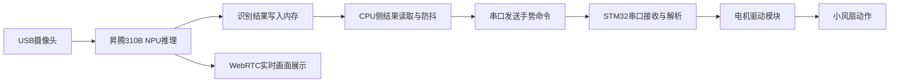

# 昇腾310B手势识别控制系统项目计划书

## 一、项目基本信息

项目名称：基于昇腾310B的实时手势识别与STM32风扇控制系统

选题方向：题目6：昇腾310B手势识别

小组人数：2人

小组成员：黄家耀，欧恩佩

| 成员 | 姓名 | 主要职责 |
| ---- | ---- | ---- |
| 成员A | 黄家耀 | 昇腾310B侧CPU代码、内存读取、串口发送、系统联调 |
| 成员B | 欧恩佩 | STM32接收解析、风扇驱动控制、硬件连接、测试记录与文档 |

项目目标：在老师提供的手势识别基础代码上完成拓展要求，实现“昇腾310B识别手势 -> CPU侧读取识别结果 -> 串口发送至STM32 -> STM32驱动小风扇执行加速、减速、停机、反转等动作”的完整闭环。

## 二、现有基础与任务边界

老师提供的代码目前已经能够完成摄像头图像采集、手势识别推理，并将识别结果写入内存。小组不重复从零训练模型，也不把主要精力放在模型转换和推理流程改造上，而是在现有识别结果的基础上完成控制链路。

本组主要开发内容如下：

1. 昇腾310B CPU侧程序：从共享内存或指定结果缓冲区读取最新手势类别、置信度和时间戳。
2. 结果筛选与防抖：根据置信度阈值、连续帧一致性和最小发送间隔过滤误识别。
3. 串口通信：将稳定手势结果按照约定协议发送到STM32。
4. STM32控制程序：接收串口数据，解析手势命令，输出PWM/方向控制信号驱动小风扇。
5. 系统集成测试：验证手势识别、串口通信、风扇动作和WebRTC实时显示链路。

## 三、系统方案设计

### 3.1 总体架构

系统分为视觉识别层、通信层和执行控制层。

### 3.2 STM32侧软件模块

| 模块 | 功能 | 交付内容 |
| ---- | ---- | ---- |
| 串口接收模块 | 接收昇腾310B发送的命令帧 | USART中断或DMA接收代码 |
| 协议解析模块 | 校验帧头、长度、命令和校验位 | 解析状态机 |
| 风扇控制模块 | 根据命令输出PWM和方向控制 | PWM调速、方向控制、停机 |
| 状态反馈模块 | 可选：回传ACK或当前风扇状态 | ACK帧或串口调试输出 |
| 安全保护模块 | 通信超时自动停机，非法命令忽略 | 超时计数与异常处理 |

## 四、串口通信方案

计划使用昇腾310B开发板的USB转TTL或板载UART与STM32 USART连接。

串口参数初定如下：

| 参数 | 取值 |
| ---- | ---- |
| 波特率 | 115200 bps |
| 数据位 | 8 |
| 停止位 | 1 |
| 校验位 | None |
| 电平 | 3.3V TTL |

### 4.1 命令帧格式

为降低解析难度，初版协议采用固定长度二进制帧：

| 字节 | 含义 | 示例 |
| ---- | ---- | ---- |
| Byte0 | 帧头1 | `0xAA` |
| Byte1 | 帧头2 | `0x55` |
| Byte2 | 手势ID | `0x01` |
| Byte3 | 动作命令 | `0x10` |
| Byte4 | 参数 | 速度档位0-100 |
| Byte5 | 校验 | Byte2+Byte3+Byte4低8位 |

### 4.2 手势-动作映射

最终手势类别以代码输出的类别表为准。计划先选取4-6个识别稳定的手势完成控制。

| 手势 | 手势ID | STM32动作 | 说明 |
| ---- | ---- | ---- | ---- |
| thumbs_up/点赞 | `0x01` | 加速 | PWM占空比增加10% |
| palm/张掌 | `0x02` | 停机 | PWM置0 |
| fist/握拳 | `0x03` | 减速 | PWM占空比减少10% |
| ok/OK手势 | `0x04` | 启动 | 恢复默认速度 |
| left/right或指定手势 | `0x05` | 反转 | 切换电机方向 |

防抖策略：连续3帧识别为同一手势、置信度大于0.60，且距离上次发送超过300 ms时，才向STM32发送一次控制命令。

## 五、工作计划与时间节点

| 日期 | 阶段 | 计划任务 | 里程碑 |
| ---- | ---- | ---- | ---- |
| 2026-06-29 | 选题与方案确认 | 明确选择昇腾310B手势识别；确认老师代码已有识别结果内存写入；确定拓展方向为STM32风扇控制 | 完成项目计划书初稿 |
| 2026-06-30 9:00前 | 提交计划书 | 完成工作计划、时间安排、物料采购计划、分工方案 | 提交《项目计划书》 |
| 2026-06-30 | 代码接口确认 | 阅读老师代码，定位识别结果结构体/共享内存地址/更新时机；确定串口设备名 | 明确CPU侧读取接口 |
| 2026-07-01 | 通信链路开发 | 完成昇腾310B串口发送测试；STM32串口接收测试；PC串口助手辅助验证 | 310B与STM32可互发数据 |
| 2026-07-02 9:00前 | 设计文档与汇报 | 整理系统架构、硬件框图、软件流程图、通信协议和物料状态 | 提交《系统设计文档》 |
| 2026-07-02至07-04 | 功能开发 | 完成结果读取、防抖、手势映射、命令发送；完成STM32 PWM调速与方向控制 | 单模块功能可运行 |
| 2026-07-05 | 联调测试 | 手势识别结果通过串口控制风扇；记录延迟、误触发和稳定性问题 | 完成基本闭环演示 |
| 2026-07-06 15:00前 | 中期检查 | 提交物料到位情况、当前进度、测试用例、风险与解决方案 | 提交《中期检查报告》 |
| 2026-07-07至07-08 | 优化与补充 | 优化防抖阈值、串口异常重连、风扇动作响应；录制演示视频 | 达到验收演示状态 |
| 2026-07-09 9:00 | 第一次验收 | 现场演示手势识别、WebRTC画面、风扇控制动作 | 收集老师修改意见 |
| 2026-07-09至07-10 | 修改完善 | 根据第一次验收反馈修正问题，补齐测试记录与答辩材料 | 准备第二次验收 |
| 2026-07-10 9:00 | 第二次验收 | 完成最终演示与答辩 | 最终验收 |
| 验收后一周内 | 个人总结 | 各自完成个人总结报告 | 提交个人总结 |

## 六、组内时间安排与协作方式

两名成员每天至少进行一次短会或线上同步，内容包括当天完成情况、遇到的问题、次日任务和接口变更。串口协议、手势ID映射和接线方式一旦确定，需要同步写入文档，避免两侧程序不一致。

| 成员 | 可投入时间 | 重点工作 |
| ---- | ---- | ---- |
| 成员A | 每日3-5小时，验收前两天集中联调 | 昇腾310B侧CPU读取、串口发送、日志、WebRTC展示配合 |
| 成员B | 每日3-5小时，硬件到位后集中调试 | STM32串口接收、PWM风扇控制、接线、电源与驱动测试 |

协作文件约定：

| 文件/资料 | 负责人 | 内容 |
| ---- | ---- | ---- |
| 通信协议文档 | 成员A、成员B共同维护 | 帧格式、手势ID、动作命令、校验方式 |
| 测试记录表 | 成员B主写，成员A补充 | 测试日期、手势、发送命令、风扇响应、问题 |
| 系统设计文档 | 成员A主写，成员B补充硬件 | 架构图、软件流程图、硬件连接图 |
| 演示视频与截图 | 成员A、成员B共同完成 | WebRTC画面、串口日志、风扇动作 |

## 七、物料采购计划

优先复用课程提供的昇腾310B开发板和STM32最小系统板。以下价格为预估，实际以采购页面为准。

| 物料 | 型号/规格 | 数量 | 预估单价 | 采购渠道 | 用途 |
| ---- | ---- | ---- | ---- | ---- | ---- |
| 昇腾310B开发板 | OrangePi AIpro或课程提供板卡 | 1 | 课程提供 | 课程提供 | 手势识别与串口发送 |
| STM32最小系统板 | STM32F103C8T6 | 1 | 课程提供/约15元 | 课程提供/淘宝 | 风扇控制 |
| USB摄像头 | 支持MJPG，推荐720p/30fps | 1 | 30-60元 | 淘宝/京东 | 图像采集 |
| USB转TTL模块 | CH340/CP2102，3.3V | 1 | 8-15元 | 淘宝/实验室 | 310B与STM32串口连接 |
| 小风扇/直流电机 | 5V或12V直流风扇 | 1 | 10-25元 | 淘宝/实验室 | 执行器 |
| 电机驱动模块 | TB6612或L298N | 1 | 8-20元 | 淘宝/实验室 | 控制风扇转速与方向 |
| 杜邦线 | 公对母/母对母 | 若干 | 5-10元 | 实验室/淘宝 | 模块连接 |
| 外部电源 | 5V/12V适配器或电池 | 1 | 15-30元 | 实验室/淘宝 | 风扇供电 |
| 面包板 | 小型面包板 | 1 | 5-10元 | 实验室/淘宝 | 临时连接 |

预估新增成本：约81-170元。若摄像头、STM32、驱动模块和电源可由实验室提供，则实际采购成本可进一步降低。

## 八、测试与验收指标

| 测试项 | 测试方法 | 通过标准 |
| ---- | ---- | ---- |
| 手势识别功能 | 摄像头前依次展示选定手势 | 可稳定识别至少18种手势；控制用手势识别稳定 |
| CPU侧读取 | 打印内存读取到的手势ID、置信度、时间戳 | 结果与画面显示一致，更新及时 |
| 串口发送 | 用串口助手或STM32日志查看数据帧 | 帧头、命令、校验正确，丢包率低 |
| STM32解析 | 输入模拟命令帧 | 能正确解析合法帧，忽略非法帧 |
| 风扇控制 | 发送加速、减速、停机、反转命令 | 风扇动作与命令一致 |
| 端到端延迟 | 记录手势出现到风扇动作的时间 | 目标小于1秒 |
| 稳定性 | 连续运行10-20分钟 | 无程序崩溃，误触发次数可接受 |
| 演示效果 | WebRTC画面+实物风扇同步展示 | 能清楚展示识别结果和控制效果 |

## 九、风险与应对措施

| 风险 | 影响 | 应对措施 |
| ---- | ---- | ---- |
| 老师代码的内存结构不清楚 | CPU侧读取困难 | 先定位写入函数和数据结构，必要时在写入点增加统一接口 |
| 串口设备权限或设备名变化 | 无法打开串口 | 使用启动参数配置设备名，如`/dev/ttyUSB0`；准备串口助手验证 |
| 手势误识别导致风扇误动作 | 演示不稳定 | 增加置信度阈值、连续帧确认和发送冷却时间 |
| 风扇电流过大 | STM32或USB供电异常 | 风扇单独供电，STM32只输出控制信号，共地连接 |
| 电机反转硬件不支持 | 无法完成反转动作 | 优先选用TB6612/L298N；若普通二线风扇不支持反转，则用指示灯或双向直流电机替代演示 |
| 联调时间不足 | 验收前功能不完整 | 先完成“识别->串口->停机/启动”最小闭环，再扩展加减速与反转 |

## 十、阶段交付物

| 时间 | 交付物 |
| ---- | ---- |
| 2026-06-30 | 项目计划书 |
| 2026-07-02 | 系统设计文档、系统框图、软件流程图、通信协议初版 |
| 2026-07-06 | 中期检查报告、物料状态、单模块测试记录 |
| 2026-07-09 | 第一次验收演示、演示视频、测试数据 |
| 2026-07-10 | 最终代码、最终演示、答辩材料 |
| 验收后一周内 | 个人总结报告 |

## 十一、答辩准备要点

1. 能说明YOLOv10手势识别的大致流程：图像预处理、NPU推理、输出解码、类别与置信度。
2. 能说明为什么CPU侧需要做结果筛选和防抖：减少单帧误识别对执行器的影响。
3. 能说明串口协议设计：帧头用于同步，命令字段用于动作，校验字段用于发现错误。
4. 能说明STM32控制链路：USART接收命令，定时器PWM控制风扇速度，GPIO控制方向或启停。
5. 能展示完整闭环：手势动作、WebRTC检测画面、串口日志、风扇响应同步出现。

